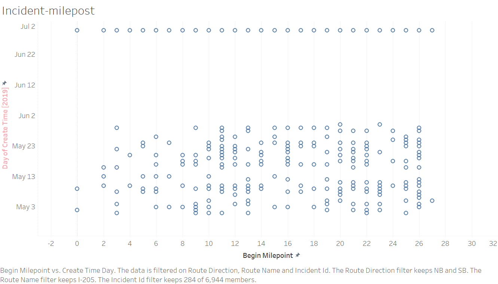

# ExplorationsInDataScience

HeatMaps : https://public.tableau.com/app/profile/akansha5101/viz/IncidentAnalysis_16287139850440/Story1#1

**TEAM - Trafficky**

Team Members:
Pooja Nalan, 
Akansha Jain, 
Deepika Gooty

# **OBJECTIVES**

To observe and analyze the pattern in traffic and any incidents that occur and also find the correlation between various traffic conditions based on speed of the vehicles, number of vehicles, average speed of vehicles on a highway, etc for a period of 5 years in Portland. Check if most incidents occur on weekends or weekdays and specific time ranges when it's most likely to happen.

# **APPROACH**

We pick two highways that have heavy usage and for which we find close to real data. Since few of us have worked with freeway data in our previous courses we can relate to the various parameters and the working of sensors placed at certain intervals at different stations on a highway. Each station has an id and information local to its location. Using data from each of these stations gives a rough idea about the vehicles that pass through them at a particular point in time. We assume that speed is one of the major contributors to incidents. And, that could be either low or high. Overspeeding and not keeping up with minimum speed are both equally dangerous on a highway.

The project makes use of average speed as an input to analyze and define congestion at different stations on the highway. Based on calculating the congestion we plot a heat map representing time and the station milestone. This way we can find how the traffic varies with time at all the stations on that highway. Using that heat map we plot the incidents that occurred. We then analyse the relation between incidents and speed. 

# **PROJECT MILESTONES**

1. Traffic data collection and creation of tables.

2. Mapping incidents on highways to the generated heatmap.

3. Generate heat maps and plot incidents for 5 years on a selective few highways.

4. Come up with a methodology to generate heat maps and plot incidents for any given highway across any time period.

5. Analyse the graphs and the important patterns/observations and the correlation between various factors that lead to congestion and incidents.

# **HeatMaps**
**1. On highway I-205 Compare the incidents occured on satuday vs sunday**

**2. Total incidents counts based on the direction**

**3.Incident occured relationship with traffic congestion**

**4. No of lanes affected on each day on highway I-205**

